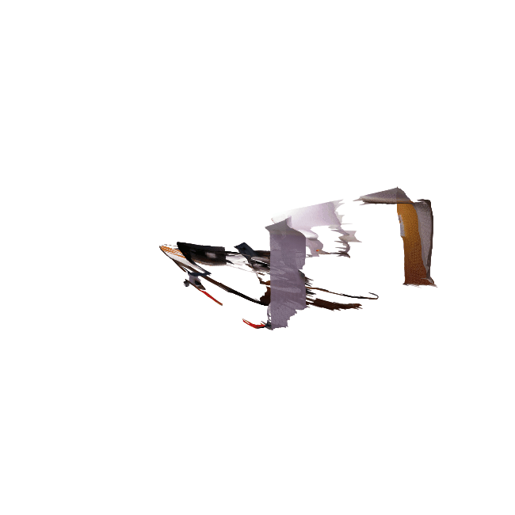
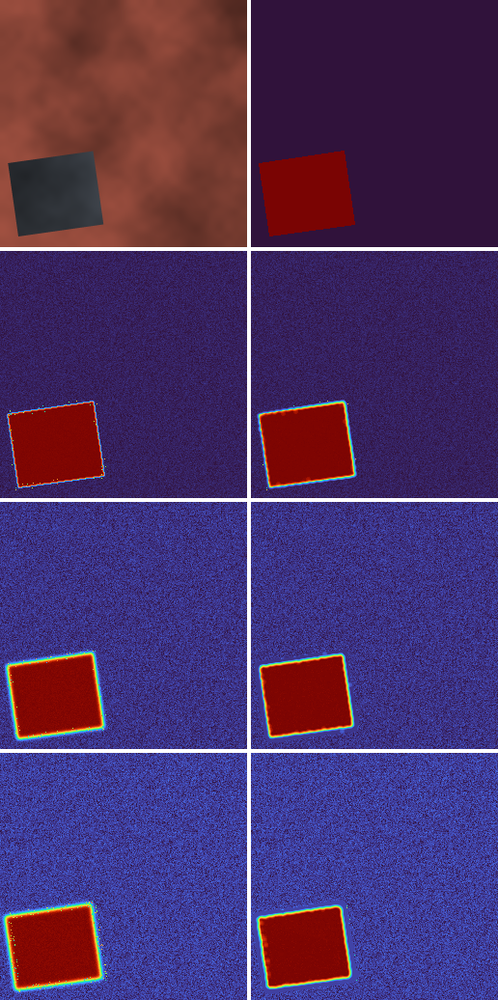
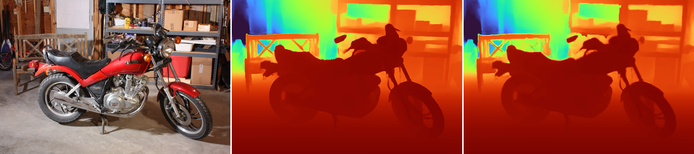
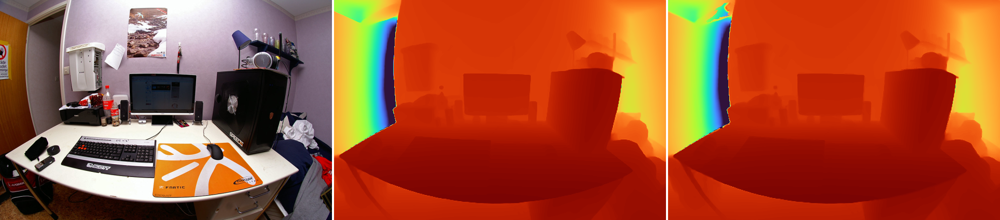
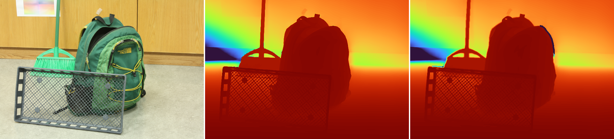
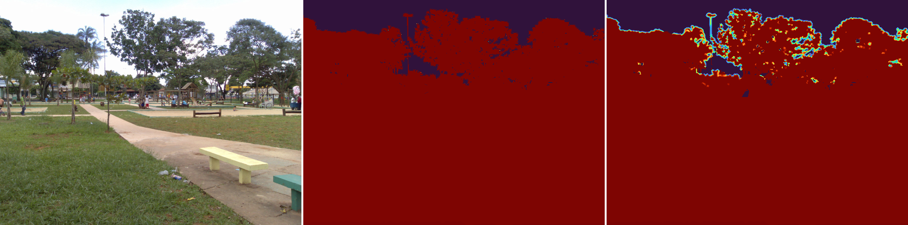

<p align="center">
  
</p>

<h1 align="center">PointSnap</h1>
<p align="center"><i>A depth model's mistakes are invisible in 2D. Lift them into 3D, and every blurred silhouette becomes a spray of points floating where nothing exists.</i></p>

<p align="center">
  
  
  
</p>

## The halo every depth model leaves behind

A monocular depth network never draws a perfectly sharp line at an object's edge: it blends foreground and background over a pixel or two, the way any regression model blurs across a discontinuity. On a 2D depth map that blur barely registers. Back-project it into 3D and it becomes a literal spray of points bridging the two surfaces: Microsoft's MoGe-3 calls these **fly-points**, and fixes them by training an entirely new geometry model with a sparse 3D refinement stage baked in.

Training a new foundation model from scratch isn't in scope for one person. This project asks a narrower question instead: **can the same fly-points be fixed after the fact, on top of a model that already exists, without retraining anything?**

<p align="center"></p>
<p align="center"><i>Top row: RGB and ground truth. Each row below: raw (left) vs. refined (right) depth at increasing corruption severity. The rainbow halo at the silhouette is the fly-point signature; refinement snaps it back to a clean edge. Background speckle is untouched noise, left alone by design.</i></p>

## Two old ideas doing a new job

Depth Anything V2 and MiDaS both predict something closer to disparity than depth: an affine-ambiguous quantity, `1/Z` up to an unknown scale *and* shift. That sounds like a problem for any geometric reasoning downstream. It isn't, because of one algebraic fact: a real 3D plane, back-projected through a pinhole and expressed in inverse depth, is **affine in pixel coordinates**, `1/Z(u,v) = A·u + B·v + C`, and an affine transform of an affine field is still affine. Every step below operates directly on raw backbone output with no calibration step, and the two novel metrics further down are built as scale-invariant ratios for the same reason.

The pipeline itself borrows two classical ideas rather than training anything new for the geometry:

1. **RANSAC** (Fischler & Bolles, 1981) fits two competing local planes (near and far) from the confident pixels surrounding each flagged region.
2. A **contrast-sensitive Potts model** (Boykov & Jolly, 2001) resolves which plane each flagged pixel actually belongs to, weighted by how similar its color is to its neighbors, so the boundary snaps to the real RGB edge instead of drifting across it.

The relabeling is solved by **checkerboard-parity ICM**: the pixel grid is 2-colored so that a half-step only ever updates pixels that aren't 4-adjacent to each other, which makes each half-step provably non-increasing in total energy, not just empirically stable. That guarantee is checked directly in `tests/test_mrf_icm_energy_nonincreasing.py`, and one real optimization run looks like this:

```
iter  energy        descent
init     1163.52   [########################################]
   1     1107.14   [#####################...................]
   2     1051.46   [#.......................................]
   3     1047.39   [........................................]
   4     1047.39   [........................................]
```

## The boundary, pixel by pixel

<p align="center"></p>
<p align="center"><i>One real boundary crossing, sampled perpendicular to the edge. Top: ground truth (one hard step). Middle: raw output (a multi-pixel rainbow smear, the bridging artifact quantified below as the Bridging Rate). Bottom: refined (snapped back to a single transition).</i></p>

## Does it actually work?

Validated on a controlled synthetic stress test with exact ground truth: procedurally composited scenes, corrupted with Gaussian blur, boundary jitter, and injected fly-pixels at three severities (150 held-out test scenes per severity). Two metrics defined specifically for this problem, since standard depth metrics can't see it:

- **Point-Isolation Score (PIS)**: a boundary point's real 3D k-NN spacing divided by its local surface's expected spacing. PIS ≫ 1 is the literal signature of a point floating in emptier space than its neighborhood implies.
- **Bridging Rate (BR)**: the fraction of boundary crossings where no single pixel step carries most of the total depth jump, i.e. the transition is smeared rather than a hard edge.

| Severity | Median PIS (raw → refined) | Isolation rate¹ (raw → refined) | Bridging Rate (raw → refined) | AbsRel, non-boundary² (raw → refined) |
|---|---|---|---|---|
| Easy | 2.56 → **1.10** (−57%) | 68.8% → **20.3%** (−70%) | 0.981 → **0.373** (−62%) | 0.0062 → 0.0113 |
| Moderate | 2.04 → **0.94** (−54%) | 52.2% → **10.8%** (−79%) | 0.954 → **0.382** (−60%) | 0.0112 → 0.0176 |
| Hard | 1.37 → **0.90** (−34%) | 13.6% → **5.2%** (−62%) | 0.830 → **0.427** (−49%) | 0.0216 → 0.0362 |

<sup>¹ fraction of boundary points with PIS > 2, a direct floating-point count. ² AbsRel computed away from any detected boundary region; see "Where this still breaks" for the honest read on this column.</sup>

Isolation rate and Bridging Rate both drop by roughly half to three-quarters, at every severity, on a benchmark specifically engineered to contain the exact artifact this project targets.

## Classical rules, a small net, or both?

The candidate-detection stage that flags *which* pixels might be fly-points is a hybrid: a fast classical heuristic (an unexplained-depth-edge test plus a morphological bridging-distance test) combined with a small (~0.5M-parameter) U-Net trained on the same synthetic corruption model, via noisy-OR. Measured against the synthetic ground-truth artifact mask (150 test scenes):

<div align="center">

| Severity | Detector | Precision | Recall | F1 |
|---|---|---|---|---|
| Easy | classical | 0.052 | 0.168 | 0.077 |
| Easy | CNN | 0.864 | 0.863 | **0.862** |
| Easy | ensemble (noisy-OR) | 0.148 | 0.957 | 0.255 |
| Moderate | classical | 0.198 | 0.379 | 0.252 |
| Moderate | CNN | 0.905 | 0.846 | **0.863** |
| Moderate | ensemble (noisy-OR) | 0.272 | 0.955 | 0.418 |
| Hard | classical | 0.401 | 0.483 | 0.426 |
| Hard | CNN | 0.941 | 0.750 | **0.823** |
| Hard | ensemble (noisy-OR) | 0.389 | 0.920 | 0.540 |

</div>

The honest result here isn't the one the design predicted: the CNN alone has the best standalone F1 at every severity, and noisy-OR, by construction (since either detector firing is enough), trades a lot of precision for recall. The pipeline keeps noisy-OR as the default anyway, because the *next* stage (RANSAC's bimodality check) already rejects a flagged pixel that doesn't sit in a genuinely two-surface neighborhood. A high-recall, lower-precision candidate proposal is cheap to over-produce here, since something downstream is already built to say no.

## Same fix, different model

The refinement takes raw depth as input and never touches backbone internals, so the real test is whether it helps a model it was never tuned against. Depth Anything V2 (Small) and MiDaS DPT-Hybrid (different architectures, DINOv2 vs. ViT-Hybrid, and different training recipes) both run through the identical pipeline on 6 scenes from Middlebury Stereo 2014, against real laser/stereo ground truth:

| Backbone | AbsRel (raw → refined) | δ<sub>1</sub> (raw → refined) | Median PIS (raw → refined) | Bridging Rate (raw → refined) |
|---|---|---|---|---|
| Depth Anything V2 (Small) | 0.0323 → 0.0325 | 0.9956 → 0.9955 | 1.077 → **1.061** (−1.5%) | 0.867 → **0.803** (−7.3%) |
| MiDaS DPT-Hybrid | 0.0439 → 0.0440 | 0.9912 → 0.9913 | 1.051 → **1.042** (−0.8%) | 0.983 → **0.949** (−3.5%) |

Bridging Rate improves for **both** backbones on **every one of the 6 scenes**: the full per-scene table is in `assets/results/public_benchmark.csv`. The effect size is smaller than on the synthetic stress test, and smaller for Depth Anything V2 than for MiDaS, expected since a stronger backbone simply leaves less bridging behind to begin with. AbsRel and δ₁ barely move either way, which is the point: this is a boundary-local correction, not a global depth fix.

This benchmark stands in for iBims-1, which was the original plan: its dataset host serves files through an interactive share portal with no stable anonymous access path (confirmed directly: anonymous FTP returns `530 Login incorrect`). Middlebury 2014 ships something arguably more relevant anyway: ground-truth disparity with occluded pixels explicitly marked as invalid, a direct, real-world occlusion-boundary signal.

## On photographs nobody staged for this

<p align="center">
  
</p>
<p align="center"><i>Wheel spokes and the bench's cross-brace, thin high-frequency structure, visibly sharpen after refinement.</i></p>

<p align="center">
  
</p>
<p align="center"><i>A genuine fisheye lens photo (aLindquist, CC BY 2.0), no distortion model, just the plain pinhole pipeline. Boundary noise around the monitor and tower visibly cleans up regardless.</i></p>

<p align="center">
  
</p>
<p align="center"><i>Mesh crate and broom handle against a cluttered background: a harder case, and the gain is smaller here than the two above.</i></p>

## Where this still breaks

- **Fisheye photos get zero distortion correction.** The pipeline assumes a plain pinhole model throughout. On the fisheye desk photo above, that shows up as visible curvature in the reconstructed point cloud: a straight desk edge doesn't stay straight in 3D. The refinement still cleans up local boundary noise; it does not, and was never going to, undo radial lens distortion.
- **Local planarity is not a universal assumption, and foliage is where it fails.** Run against a park photo with dense tree canopy against open sky, the algorithm actively makes things worse: a fractal, high-frequency organic boundary has no meaningful two-plane structure for RANSAC to recover.

  <p align="center"></p>
  <p align="center"><i>The bright fringe along the tree line in the refined panel (right) is RANSAC fitting a confident "plane" to a boundary that isn't planar at any scale. Included on purpose, not cropped out.</i></p>
- **The non-boundary accuracy trade is real, not hidden.** AbsRel away from detected boundaries gets measurably worse on the synthetic benchmark (roughly 1.6–1.8× its raw value, still under 4% in absolute terms at every severity): the ensemble's high-recall candidate proposal occasionally corrects a pixel that didn't need it. The trade buys a 50-80% reduction in the specific artifact this project targets; it is not free.
- **iBims-1 substitution, small N.** The public-benchmark leg uses 6 Middlebury scenes, not the 100-image iBims-1 set the plan originally called for (see above). Six scenes across two backbones is a directional signal, not a statistically powered claim.
- **This is not a claim to beat MoGe-3, or any end-to-end trained model.** MoGe-3 solves the fly-point problem by training a new sparse 3D U-Net from scratch on curated synthetic data. This project asks the narrower, retrofit question, can an existing frozen model's output be repaired after the fact, and answers it with real numbers, not with a claim to match a Microsoft Research training run.

## Repo map

```
PointSnap/
├── src/pointsnap/
│   ├── geometry/     intrinsics, pinhole back-projection, inverse-depth plane fitting + RANSAC
│   ├── synth/        procedural scene compositor, depth corruption model, dataset generation
│   ├── detect/       classical candidate detector, confidence CNN, noisy-OR ensemble
│   ├── refine/       bi-planar RANSAC fitting, checkerboard-ICM relabeling, bilateral snap, pipeline
│   ├── backbones/    Depth Anything V2 / MiDaS wrappers, opportunistic CPU/GPU device selection
│   ├── eval/         PIS / Bridging Rate metrics, synthetic + Middlebury + real-gallery benchmark runners
│   └── viz/          depth colorization, point-cloud rendering, before/after grids, energy-trace ASCII
├── scripts/          one script per pipeline stage, run in order (see below)
├── configs/          YAML config per stage
├── tests/            44 tests: geometry, RANSAC, MRF correctness, metrics, CNN, ensemble
└── assets/           every figure/table in this README, generated from real run outputs
```

## Running it yourself

```bash
pip install -e ".[dev]"

python scripts/generate_synthetic_dataset.py     # ~3,200/400/400 train/val/test scenes
python scripts/train_confidence_cnn.py           # ~15 epochs, boundary-biased 64x64 crops
python scripts/run_synthetic_benchmark.py        # leg 1: the quantitative table above
python scripts/download_public_benchmark.py      # 6 Middlebury Stereo 2014 scenes (~700MB)
python scripts/run_public_benchmark.py           # leg 2: model-agnosticism
python scripts/run_real_gallery.py               # leg 3: real photos + point-cloud GIFs
python scripts/make_figures.py                   # assembles every figure in this README
pytest -v                                        # 44 tests, CPU-only, ~15s
```

Runs entirely on CPU (CI installs the CPU-only PyTorch wheel and nothing else). A CUDA-capable GPU is used automatically if `torch.cuda.is_available()`; no code path assumes one.

## Data, models, and their licenses

- **Depth Anything V2** (`depth-anything/Depth-Anything-V2-{Small,Base}-hf`) and **MiDaS DPT-Hybrid** (`Intel/dpt-hybrid-midas`): Apache-2.0, loaded via `transformers` at run time, weights not redistributed here.
- **Middlebury Stereo 2014**: D. Scharstein, H. Hirschmüller, Y. Kitajima, G. Krathwohl, N. Nešić, X. Wang, P. Westling, *"High-resolution stereo datasets with subpixel-accurate ground truth,"* GCPR 2014. Academic use; not redistributed, fetched by `scripts/download_public_benchmark.py`.
- **Real-gallery photographs**: "Fisheye" by aLindquist ([Flickr](https://www.flickr.com/photos/32028492@N05/4266528423), CC BY 2.0); "Parque" by Marco Gomes ([Flickr](https://www.flickr.com/photos/39802787@N00/2354914325), CC BY 2.0).
- Everything in `src/`, `scripts/`, `tests/` is MIT-licensed (see `LICENSE`).
